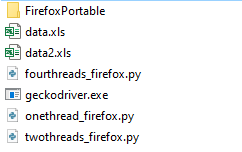
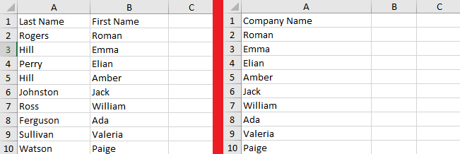
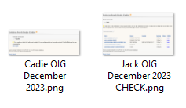

=================
OIG Scanner
=================

-------------------------
Description
-------------------------
A package to automate checking and taking screenshots from Exclusions Database | Office of Inspector General ("https://exclusions.oig.hhs.gov/")

-------------------------
What it does
-------------------------
Given the data with either **entities (companies)** or **individuals (people)** in the format "<**last name**> <**first name**> or <**entity/company name**>,
finds them in Exclusions Database and takes a screenshot in the format "<**last name**> <**first name**> OIG <**month**> <**year**>.png" or
"<**entity/company name**> OIG <**month**> <**year**>.png". Appends the word "**CHECK**" to the end of a filename if the record is found, so the compliance
person later can verify if the given individual or entity works with them.

-------------------------
Installation
-------------------------
1. Run "pip install -r requirements.txt"
2. Run "pip install ." in the folder with "setup.py".
3. Install **firefox portable** and **geckodriver**, then put them in the same folder with scripts. (If using scripts in the repository)

-------------------------
Usage
-------------------------
The entry point are python scripts in the scripts folder. Provided you installed everything correctly, the folder should look like this.

You can choose to either run scans for individuals or entities. Excel file should be either **xls** or **xlsx** format.
It should have either **two columns** (<**last name**> <**first name**> - **EXACTLY THIS ORDER**) for individuals
or **one column** (<**entity name**>) for entities

Example of how it should be. On the left from the right line example for individuals, on the right for entities

After that run "python <**script**> <**excel file**>"

It will show you the entities or individuals that the program is going to scan. After that the folder named
"screenshots_individuals" or "screenshots_entities" will appear, where screenshots will be saved

There is two type of screenshots. One with the word **CHECK** and the other without it. **CHECK** means
that the person or entity was found in the exclusion database and should be further investigated by the compliance.

-------------------------
Features
-------------------------
- can use multiple browsers and webdrivers (needs to be implemented in templates.py)
- can use different month and year if needed
- can use multiple threads
